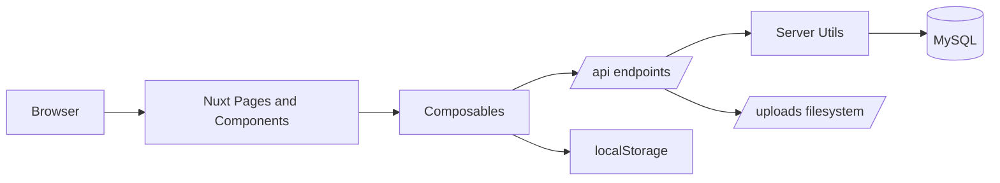

# Buyer Project Code Wiki

## 1. Overview

`buyer-project` is a small full-stack storefront built with Nuxt 3. It combines:

- a Vue 3 client rendered through Nuxt pages and components
- lightweight shared frontend state using Nuxt composables and `useState`
- a Nitro server layer under `server/api`
- MySQL-backed product, user, session, and order data

The repository is organized as a monolithic Nuxt application, so frontend UI, server endpoints, and server utilities all live in the same codebase.

## 2. Tech Stack

### Runtime

- `nuxt` for the application framework, file-based routing, Nitro server routes, and runtime config
- `vue` for UI rendering and reactive state
- `mysql2/promise` for database access
- `formidable` for multipart file uploads

### Styling

- `@nuxtjs/tailwindcss` is installed as a module
- most actual styling is implemented with component-scoped CSS
- `assets/css/product-thumb.css` provides shared CSS variables for product thumbnail layouts

### Deployment Shape

- one Nuxt process serves both the web app and the `/api/*` routes
- MySQL is required at runtime
- uploaded product images are exposed at `/uploads/*`

## 3. Repository Structure

```text
buyer-project/
├── app.vue
├── nuxt.config.js
├── package.json
├── plugins/
│   └── auth.js
├── composables/
│   ├── useAuth.js
│   ├── useCart.js
│   └── useWishlist.js
├── components/
│   ├── Navbar.vue
│   ├── Footer.vue
│   ├── Productcard.vue
│   └── CartItem.vue
├── pages/
│   ├── index.vue
│   ├── cart.vue
│   ├── login.vue
│   ├── wishlist.vue
│   └── product/
│       └── [id].vue
├── server/
│   ├── api/
│   │   ├── auth/
│   │   │   ├── login.post.js
│   │   │   ├── logout.post.js
│   │   │   └── me.get.js
│   │   ├── products/
│   │   │   ├── index.get.js
│   │   │   └── [id].get.js
│   │   ├── health.get.js
│   │   ├── orders.post.js
│   │   └── upload.post.js
│   ├── uploads/
│   └── utils/
│       ├── auth.js
│       ├── db.js
│       ├── products.js
│       └── schema.js
├── assets/
│   └── css/
├── public/
│   ├── uploads/
│   └── placeholder-product.svg
└── docs/
    └── CODE_WIKI.md
```

## 4. Architecture Summary

### High-Level Design

The app follows a simple layered design:

1. `pages/` own screen-level orchestration and API fetching
2. `components/` render reusable UI pieces
3. `composables/` hold cross-page state and common actions
4. `server/api/` exposes HTTP endpoints
5. `server/utils/` contains reusable backend helpers for DB access, auth, schema setup, and product normalization
6. MySQL stores business data, while the browser stores wishlist data locally

### Request And Data Flow



### Main Runtime Flows

- Product catalog flow:
  `pages/index.vue` -> `GET /api/products` -> `server/api/products/index.get.js` -> `server/utils/products.js` -> MySQL `products`
- Product detail flow:
  `pages/product/[id].vue` -> `GET /api/products/:id` -> product utility mapping -> one normalized product payload
- Auth flow:
  `plugins/auth.js` -> `useAuth.fetchUser()` -> `GET /api/auth/me` -> `server/utils/auth.js`
- Checkout flow:
  `pages/cart.vue` -> `POST /api/orders` -> `requireUser()` -> `ensureOrderTables()` -> MySQL `orders` and `order_items`
- Wishlist flow:
  `useWishlist()` <-> browser `localStorage`

## 5. Frontend Architecture

### App Shell

#### `app.vue`

- provides the permanent page chrome
- renders `Navbar`, `NuxtPage`, and `Footer`
- reserves top spacing for the fixed navigation bar

#### `plugins/auth.js`

- runs during app startup
- calls `useAuth().fetchUser()` to hydrate login state from the server session cookie
- ensures navigation renders with the current authenticated user when available

### Pages

#### `pages/index.vue`

Responsibilities:

- fetches the product catalog with `useFetch('/api/products')`
- computes category filters
- keeps the selected category synchronized with the route query string
- filters the current product list by category and search text
- delegates "add to cart" behavior to `useCart()`

Notable behavior:

- uses a predefined category list of `Men`, `Women`, `Jewellery`, and `Electronics`
- appends extra categories returned by the API
- treats category matching case-insensitively

#### `pages/product/[id].vue`

Responsibilities:

- fetches one product using the dynamic route parameter
- computes a fallback image when loading fails
- allows adding the product to cart
- allows toggling wishlist membership

#### `pages/cart.vue`

Responsibilities:

- renders cart contents using `CartItem`
- computes subtotal, tax, and total
- requires login before allowing order placement
- submits order data to `POST /api/orders`
- clears cart state after a successful order

Notable behavior:

- tax is hard-coded at `18%` on both client and server
- cart state is in-memory only and is not persisted across reloads

#### `pages/wishlist.vue`

Responsibilities:

- displays the locally persisted wishlist
- navigates back to product detail pages
- copies wishlist entries into the cart

#### `pages/login.vue`

Responsibilities:

- performs simple client-side validation for `name` and `phone`
- delegates authentication to `useAuth().login(name, phone)`
- redirects to the home page after successful login

Notable behavior:

- authentication is identity-based and expects a matching row in the database `users` table
- there is no password field in the current implementation

### Components

#### `components/Navbar.vue`

Responsibilities:

- renders the main navigation
- displays cart and wishlist item badges
- shows authenticated user information
- provides desktop and mobile navigation modes
- triggers logout through `useAuth().logout()`

Dependencies:

- `useCart()`
- `useWishlist()`
- `useAuth()`

#### `components/Footer.vue`

- documents available routes in the UI itself
- links to route-based category filters
- provides descriptive storefront copy

#### `components/Productcard.vue`

Responsibilities:

- displays product image, category, title, rating, and price
- emits `add-to-cart` to its parent page
- toggles wishlist membership locally
- navigates to the product detail page on card click

Notable implementation detail:

- this component uses the Vue Options API, while most other Vue files use `<script setup>`

#### `components/CartItem.vue`

Responsibilities:

- renders one cart line item
- provides quantity increment and decrement controls
- emits `update-qty` and `remove` to the cart page
- falls back to a placeholder image when the item image fails to load

### Composables

#### `composables/useAuth.js`

This composable is the frontend auth state manager.

Key exports:

- `user`: shared reactive state stored under `auth-user`
- `isLoggedIn`: computed boolean derived from `user`
- `fetchUser()`: fetches `/api/auth/me` and hydrates the current user
- `login(name, phone)`: posts credentials to `/api/auth/login`
- `logout()`: posts to `/api/auth/logout`, clears local auth state, and redirects home

#### `composables/useCart.js`

This composable is the shared cart store.

Key exports:

- `items`: shared reactive state stored under `cart-items`
- `addToCart(product)`: increments an existing item or inserts a new item with `qty: 1`
- `updateQty(id, qty)`: changes quantity or removes the item when `qty <= 0`
- `removeFromCart(id)`: removes one line item
- `clearCart()`: empties the cart
- `itemCount`: computed total quantity across all lines
- `subtotal`: computed monetary subtotal

#### `composables/useWishlist.js`

This composable is the shared wishlist store.

Key exports:

- `items`: shared reactive state stored under `wishlist-items`
- `addToWishlist(product)`: stores a reduced product snapshot
- `removeFromWishlist(id)`: removes one entry
- `toggleWishlist(product)`: adds or removes based on current membership
- `isInWishlist(id)`: membership check
- `clearWishlist()`: clears the wishlist
- `itemCount`: computed number of saved items

Persistence model:

- hydrates from `localStorage` on the client
- persists via a deep `watch()` on the state
- skips browser storage access on the server

## 6. Backend Architecture

### Server API Endpoints

#### `server/api/health.get.js`

- runs a simple `SELECT 1`
- used to confirm database connectivity

#### `server/api/auth/login.post.js`

Responsibilities:

- reads `name` and `phone` from the request body
- validates presence and format
- looks up a matching user in the `users` table
- creates a random session token
- inserts a session row
- sets the `auth_session` cookie

#### `server/api/auth/logout.post.js`

- deletes the current session row if one exists
- clears the session cookie

#### `server/api/auth/me.get.js`

- resolves the current user from the session cookie
- returns `{ user }`, where `user` may be `null`

#### `server/api/products/index.get.js`

- fetches all product rows
- normalizes them into frontend-safe payloads through `toProductPayload()`

#### `server/api/products/[id].get.js`

- reads the route parameter `id`
- fetches one product row
- returns `404` when the product does not exist
- normalizes the DB row using the same payload mapper as the list endpoint

#### `server/api/orders.post.js`

Responsibilities:

- requires an authenticated user
- validates cart items from the request body
- calculates subtotal, tax, and total
- ensures order tables exist
- inserts an order and its items inside a transaction

#### `server/api/upload.post.js`

Responsibilities:

- parses multipart form uploads using `formidable`
- saves the uploaded file to `public/uploads`
- returns the stored filename and URL

Security note:

- this endpoint is currently unauthenticated

### Server Utilities

#### `server/utils/db.js`

Key function:

- `getPool()`: lazily creates and returns the shared MySQL connection pool

Design note:

- the pool is cached in module scope, so the app reuses one pool instance per server process

#### `server/utils/auth.js`

Key functions:

- `getSessionToken(event)`: reads the `auth_session` cookie
- `getUserFromSession(event)`: resolves the current user by joining `sessions` and `users`
- `requireUser(event)`: throws `401` when the user is not authenticated
- `setSessionCookie(event, token, maxAgeSeconds)`: writes the session cookie
- `clearSessionCookie(event)`: removes the cookie
- `destroySession(event)`: deletes the DB session and clears the cookie

Cookie settings:

- `httpOnly: true`
- `sameSite: 'lax'`
- `path: '/'`
- `secure` only in production
- default lifetime of 7 days

#### `server/utils/schema.js`

Key functions:

- `ensureAuthTables(pool)`: creates the `sessions` table when missing
- `ensureOrderTables(pool)`: creates `orders` and `order_items` when missing

Important limitation:

- this file does not create `users` or `products`
- those tables are expected to already exist in the configured database

#### `server/utils/products.js`

This module converts raw database rows into frontend product payloads.

Key functions:

- `fetchAllProductsRows(pool)`: queries all products and tolerates schemas that do not include a `category` column
- `fetchProductRowById(pool, id)`: fetches one product with the same compatibility fallback
- `toProductPayload(row, hasCategory)`: normalizes DB data into the API contract used by the frontend

Supporting helpers:

- `isMissingColumnError(err)`: detects missing-column MySQL errors
- `inferCategoryFromName(name)`: infers categories such as `Men`, `Women`, `Electronics`, `Jewellery`, `Beauty`, or `General`
- `normalizeDbCategory(value)`: converts buffer or string DB values into a clean category string
- `publicImageUrl(image)`: converts stored image values into public URLs under `/uploads`

## 7. Data Contracts And Persistence

### Frontend Product Shape

The frontend consistently expects products in this shape:

```js
{
  id: Number,
  title: String,
  price: Number,
  oldPrice: Number | null,
  category: String,
  image: String,
  description: String,
  rating: {
    rate: Number,
    count: Number
  }
}
```

### Persistence By Concern

- Products: stored in MySQL `products`
- Users: stored in MySQL `users`
- Sessions: stored in MySQL `sessions`, referenced by the `auth_session` cookie
- Orders: stored in MySQL `orders` and `order_items`
- Wishlist: stored in browser `localStorage`
- Cart: stored only in Nuxt client state during the current session

### Expected Database Tables

Already expected:

- `users`
- `products`

Auto-created when needed:

- `sessions`
- `orders`
- `order_items`

## 8. Dependency Relationships

### Frontend Dependency Graph

- `app.vue` depends on `Navbar.vue` and `Footer.vue`
- `plugins/auth.js` depends on `useAuth.js`
- `pages/index.vue` depends on `useCart.js` and `components/Productcard.vue`
- `pages/product/[id].vue` depends on `useCart.js` and `useWishlist.js`
- `pages/cart.vue` depends on `useCart.js`, `useAuth.js`, and `components/CartItem.vue`
- `pages/wishlist.vue` depends on `useWishlist.js` and `useCart.js`
- `Navbar.vue` depends on `useCart.js`, `useWishlist.js`, and `useAuth.js`
- `Productcard.vue` depends on `useWishlist.js`

### Backend Dependency Graph

- API handlers depend on `server/utils/db.js` for DB access
- auth endpoints depend on `server/utils/auth.js` and `server/utils/schema.js`
- product endpoints depend on `server/utils/products.js`
- `server/utils/auth.js` depends on `server/utils/db.js` and `server/utils/schema.js`
- order placement depends on DB transactions and table creation from `server/utils/schema.js`

### External Dependencies

- `mysql2/promise` powers database access
- `formidable` powers file upload parsing
- Node built-ins `crypto`, `buffer`, `fs`, and `path` support sessions, data normalization, and file handling

## 9. Key Functions Reference

This project contains almost no traditional classes. The important units are composables, Vue component methods, Nitro handlers, and backend utility functions.

| Symbol | Location | Responsibility |
| --- | --- | --- |
| `fetchUser()` | `composables/useAuth.js` | Loads the current authenticated user from the server |
| `login(name, phone)` | `composables/useAuth.js` | Logs in and stores the returned user in shared state |
| `logout()` | `composables/useAuth.js` | Ends the session and redirects home |
| `addToCart(product)` | `composables/useCart.js` | Inserts or increments a cart line item |
| `updateQty(id, qty)` | `composables/useCart.js` | Updates quantity or removes the line item |
| `toggleWishlist(product)` | `composables/useWishlist.js` | Adds or removes a product from wishlist state |
| `canonicalCategoryFromQuery(raw)` | `pages/index.vue` | Normalizes the category query string into a known filter value |
| `placeOrder()` | `pages/cart.vue` | Validates frontend state and submits the checkout request |
| `handleLogin()` | `pages/login.vue` | Validates form input and runs the login flow |
| `handleAddToCart()` | `components/Productcard.vue` | Emits a cart insertion event and shows temporary feedback |
| `getPool()` | `server/utils/db.js` | Creates or returns the shared MySQL pool |
| `getUserFromSession(event)` | `server/utils/auth.js` | Resolves the current user from the session token |
| `requireUser(event)` | `server/utils/auth.js` | Guards protected routes with a `401` when needed |
| `destroySession(event)` | `server/utils/auth.js` | Deletes the session record and clears the cookie |
| `ensureAuthTables(pool)` | `server/utils/schema.js` | Creates the `sessions` table when missing |
| `ensureOrderTables(pool)` | `server/utils/schema.js` | Creates order tables when missing |
| `fetchAllProductsRows(pool)` | `server/utils/products.js` | Loads all products with backward-compatible category handling |
| `fetchProductRowById(pool, id)` | `server/utils/products.js` | Loads one product with backward-compatible category handling |
| `toProductPayload(row, hasCategory)` | `server/utils/products.js` | Maps raw DB rows into frontend payloads |

## 10. Configuration

### `nuxt.config.js`

Important settings:

- enables Nuxt devtools
- loads the Tailwind module
- loads shared CSS from `assets/css/product-thumb.css`
- exposes runtime DB settings
- maps `server/uploads` to `/uploads` using Nitro public assets

### Environment Variables

`.env.example` defines:

```bash
DB_HOST=localhost
DB_USER=root
DB_PASSWORD=
DB_NAME=demostore
SESSION_SECRET=change-me-in-production
```

Notes:

- `DB_*` variables are used by `server/utils/db.js`
- `SESSION_SECRET` exists in runtime config but is not currently used by the session implementation
- session auth currently relies on random DB-backed tokens instead of a signed cookie payload

## 11. How To Run The Project

### Prerequisites

- Node.js and npm
- MySQL running locally
- a database containing at least `users` and `products`

### Setup

1. Install dependencies:

```bash
npm install
```

2. Create a local environment file:

```bash
cp .env.example .env
```

3. Update `.env` if your database host, user, password, or database name differ.

4. Start MySQL and ensure the configured database exists.

### Development

Run the Nuxt development server:

```bash
npm run dev
```

Nuxt serves:

- the frontend pages
- the Nitro server endpoints under `/api/*`

Useful runtime checks:

- open `/api/health` to verify DB connectivity
- open `/` to verify product listing
- open `/login` to verify user authentication against your `users` table

### Production Build

```bash
npm run build
npm run preview
```

## 12. Known Caveats And Implementation Notes

- `README.md` mentions extra scripts such as `dev:vite-only` and `dev:api`, but the current `package.json` only defines `dev`, `build`, `preview`, and `postinstall`
- `Productcard.vue` uses the Options API, while the rest of the Vue code mostly uses Composition API with `<script setup>`
- login is based on `name` and `phone` only; no password or hashing is implemented
- cart state is not persisted, so page reloads clear the cart
- wishlist state is persisted in `localStorage`, so it is browser-specific
- the upload endpoint stores files in `public/uploads`, while Nitro configuration additionally exposes `server/uploads`; both contribute to the `/uploads/*` story and should be kept aligned
- product ratings are static placeholder values generated in `toProductPayload()`
- `assets/css/main.css` exists but is currently empty and unused

## 13. Suggested Reading Order

If you are new to the repository, read files in this order:

1. `package.json`
2. `nuxt.config.js`
3. `app.vue`
4. `pages/index.vue`
5. `composables/useAuth.js`
6. `composables/useCart.js`
7. `composables/useWishlist.js`
8. `server/api/products/index.get.js`
9. `server/utils/products.js`
10. `server/utils/auth.js`
11. `server/api/orders.post.js`

